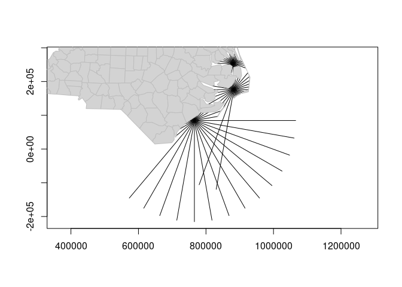
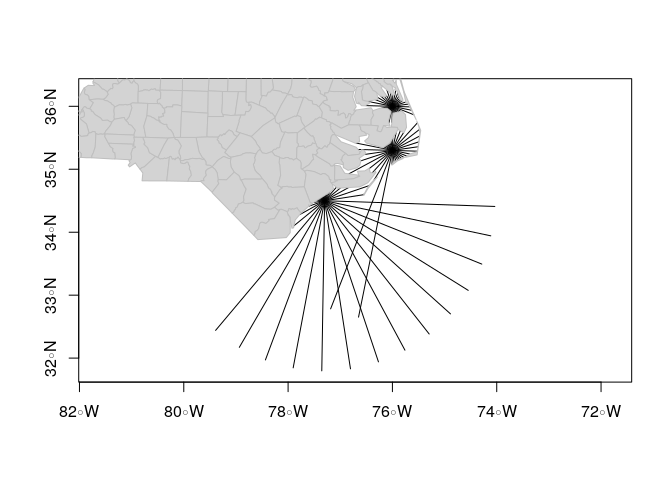
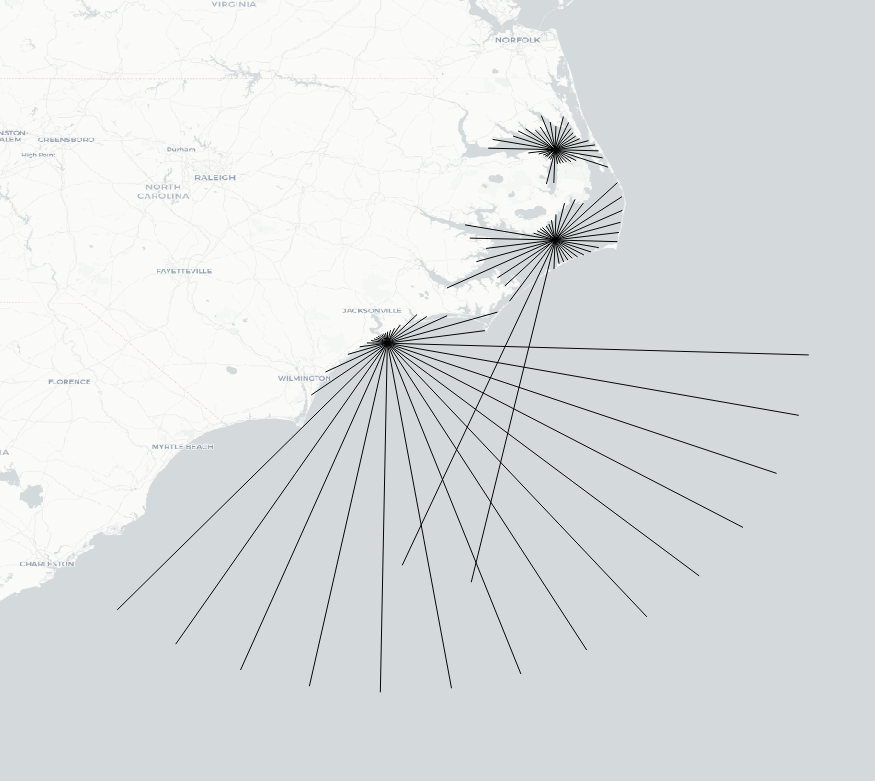

<!-- README.md is generated from README.Rmd. Please edit that file -->

# Wind fetch

Wind fetch is an important measurement in coastal applications. It
provides a measurement for the unobstructed length of water over which
wind from a certain direction can blow over. The higher the wind fetch
from a certain direction, the more energy is imparted onto the surface
of the water resulting in a larger sea state. Therefore, the larger the
fetch, the larger the exposure to wind and the more likely the site
experiences larger sea states.

# Why **windfetch**?

Averaging the wind fetch for numerous directions at the same location is
a reasonable measure of the overall wind exposure. The process of
manually calculating wind fetch can be extremely time-consuming and
tedious, particularly if a large number of fetch vectors are required at
many locations. The **windfetch** package calculates wind fetch for any
marine location on Earth. There are also plot methods to help visualise
the wind exposure at the various locations, and the ability to output
the fetch vectors to a shape file for further investigation.

# Installation

You can install and load the latest version of **windfetch** from
GitHub.

``` r
if (!require(remotes))
  install.packages("remotes")

# Install windfetch
remotes::install_github("blasee/windfetch")
```

``` r
# Load the windfetch and sf package
library(windfetch)
library(sf)
#> Linking to GEOS 3.6.2, GDAL 2.2.3, PROJ 4.9.3

# Read a shapefile of the North Carolina coastline
nc = st_read(system.file("shape/nc.shp", package = "sf"), quiet = TRUE)

# Create an sf geometry
ncg = st_geometry(nc)

# Project the coastline using the NAD83 projection
nc_proj = st_transform(ncg, "epsg:32119")

# Create a dataframe of the sites to calculate wind fetch at
sites_df = data.frame(lon = c(-76, -76, -77.3),
                      lat = c(36, 35.3, 34.5))

# Include spatial reference information by transforming to an sf object
sites_points = st_as_sf(sites_df, coords = c("lon", "lat"), crs = "epsg:4326")

# Project the points onto the same projection as the coastline
sites_points_proj = st_transform(sites_points, "epsg:32119")
```

# Calculating wind fetch with the **windfetch** package

If you already have an `sf` polygon object representing the coastline
and surrounding islands, and an `sf` points object representing the
locations, then calculating wind fetch with **windfetch** is easy. You
can just pass these two arguments into the `windfetch()` function.

``` r
plot(ncg, col = "lightgrey", border = "grey")
plot(sites_points, pch = "x", add = TRUE)
text(st_coordinates(sites_points), labels = paste("Site", 1:3), pos = 3)
```


``` r
# Calculate wind fetch by passing in the projected sf polygons object (nc_proj)
# and the projected points object (sites_points_proj) to the windfetch function.
my_fetch_proj = windfetch(nc_proj, sites_points_proj, progress_bar = FALSE)
#> checking site locations are not on land

summary(my_fetch_proj)
#> # A tibble: 12 x 3
#> # Groups:   site_name [3]
#>    site_name quadrant avg_fetch
#>    <chr>     <fct>          [m]
#>  1 Site 1    North        23283
#>  2 Site 1    East         24894
#>  3 Site 1    South        14719
#>  4 Site 1    West         25129
#>  5 Site 2    North        27798
#>  6 Site 2    East         39169
#>  7 Site 2    South        90776
#>  8 Site 2    West         45870
#>  9 Site 3    North        12849
#> 10 Site 3    East        192876
#> 11 Site 3    South       300000
#> 12 Site 3    West         24556
```

The `my_fetch_proj` object provides a summary of the fetch for all the
four quadrants, along with an average of the fetch length at all the
sites.

# Visualise the fetch vectors

## Projected space

``` r
# Plot the fetch vectors and the coastline in the projected space
plot(my_fetch_proj, axes = TRUE)
plot(nc_proj, col = "lightgrey", border = "grey", add = TRUE)
```

<!-- -->

## Unprojected latitude and longitude space

``` r
# Transform the CRS back to lats and longs
my_fetch_latlon = crs_transform(my_fetch_proj, "epsg:4326")

# Plot the fetch vectors and the coastline in lat lon space
plot(my_fetch_latlon, axes = TRUE)
plot(ncg, col = "lightgrey", border = "grey", add = TRUE)
```

<!-- -->

# Export to an ESRI shape file

``` r
# Transform the fetch object to an sf object
my_fetch_sf = as_sf(my_fetch_latlon)
my_fetch_sf
#> Simple feature collection with 108 features and 4 fields
#> geometry type:  LINESTRING
#> dimension:      XY
#> bbox:           xmin: -79.39009 ymin: 31.79712 xmax: -74.03681 ymax: 36.26015
#> CRS:            epsg:4326
#> First 10 features:
#>    site_name directions quadrant        fetch                       geometry
#> 1     Site 1          0    North 19850.17 [m] LINESTRING (-76 36, -75.993...
#> 2     Site 1         10    North 28594.44 [m] LINESTRING (-76 36, -75.935...
#> 3     Site 1         20    North 24833.20 [m] LINESTRING (-76 36, -75.897...
#> 4     Site 1         30    North 20920.73 [m] LINESTRING (-76 36, -75.877...
#> 5     Site 1         40    North 18560.48 [m] LINESTRING (-76 36, -75.862...
#> 6     Site 1         50     East 17869.99 [m] LINESTRING (-76 36, -75.844...
#> 7     Site 1         60     East 19120.77 [m] LINESTRING (-76 36, -75.813...
#> 8     Site 1         70     East 24213.79 [m] LINESTRING (-76 36, -75.744...
#> 9     Site 1         80     East 27891.44 [m] LINESTRING (-76 36, -75.693...
#> 10    Site 1         90     East 30052.82 [m] LINESTRING (-76 36, -75.666...
```

``` r
# Export the fetch vectors to an ESRI shape file for further investigation
st_write(nc_fetch_sf, "nc_fetch.shp", driver = "ESRI Shapefile")
```



# Get started with **windfetch**

Read the short introductory vignette to get you started with
**windfetch**, and have a look at the simple, reproducible example in
the `windfetch()` function.

``` r
# A simple reproducible example
example(windfetch)
```

# Citation

``` r
citation("windfetch")
#> Warning in citation("windfetch"): no date field in DESCRIPTION file of package
#> 'windfetch'
#> Warning in citation("windfetch"): could not determine year for 'windfetch' from
#> package DESCRIPTION file
#> 
#> To cite package 'windfetch' in publications use:
#> 
#>   Who wrote it (NA). windfetch: What the Package Does (Title Case). R
#>   package version 0.1.0.
#> 
#> A BibTeX entry for LaTeX users is
#> 
#>   @Manual{,
#>     title = {windfetch: What the Package Does (Title Case)},
#>     author = {Who wrote it},
#>     note = {R package version 0.1.0},
#>   }
#> 
#> ATTENTION: This citation information has been auto-generated from the
#> package DESCRIPTION file and may need manual editing, see
#> 'help("citation")'.
```
